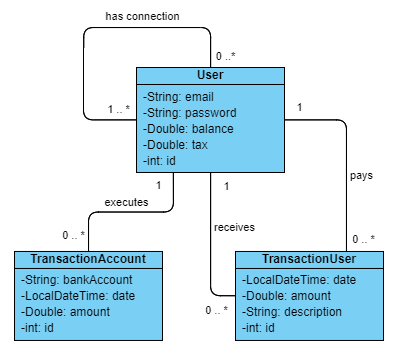
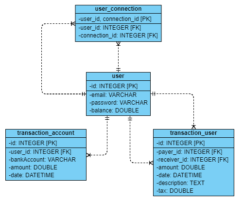

# PayMyBuddy

PayMyBuddy is an application that allows friends to easily send money to each other.

With PayMyBuddy, you will be able to:
- create an account
- deposit or withdraw money at any time to your account
- add new connections with their email
- transfer money to your friends

## Installation

### Application

Clone the source repository using Git:

https://github.com/AntoineLanselle/PayMyBuddy.git

Open your IDE, and run PayMyBuddyApplication.java to launch the application.

To access the application, open your browser, go to http://localhost:8080

### Database

To create the database, open your SGBD and run the script [scriptsSQL/données.txt](scriptsSQL/données_bdd.txt)

Once your database is created, you can padd data in it by running [scriptsSQL/structure.txt](scriptsSQL/structure_bdd.txt) 
Or by running the app, then creating your own users to test the app.

## UML diagram

## Physical data model

